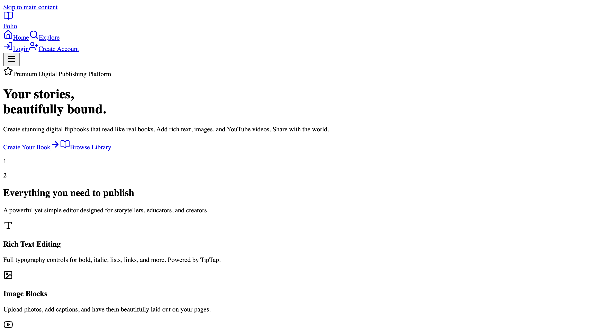

# Folio

Folio is a flipbook publishing app built with Next.js and FastAPI. It lets users create draft flipbooks, edit them in a block-based ebook editor, publish them publicly when ready, and share them through public reader links.

This codebase is intentionally MVP-oriented. Authentication, sessions, analytics, API keys, and content storage are implemented in a simple CSV-backed backend so the product can stay easy to inspect and extend.

## Stack

- Next.js 15 App Router frontend
- FastAPI backend
- CSV-backed data store in `data/`
- Edge-runtime-friendly frontend pages
- Radix UI, Tailwind CSS, and Lucide icons

## Current Product Surface

- CSV-backed user accounts and sessions
- Creator dashboard with draft/public visibility flow
- Flipbook editor with page/block editing
- Public reader and shareable published links
- Settings page with profile updates
- Developer mode, API key management, and docs access
- View tracking and account analytics
- Locale-aware UI detection with English, Spanish, French, German, and Portuguese

## Important MVP Notes

- User data, sessions, and API keys are stored in CSV files.
- Passwords are stored in plain text because this MVP was explicitly requested to avoid bcrypt/JWT complexity.
- The first registered user becomes `admin`.
- Password reset support is handled manually via `info@techrealm.online`.

## Local Development

1. Create a Python virtual environment and install backend dependencies.
2. Install frontend dependencies with `npm install`.
3. Copy `.env.example` to `.env.local`.
4. Set `FASTAPI_BASE_URL=http://127.0.0.1:8002` in `.env.local`.
5. Start the backend with `npm run api:dev`.
6. Start the frontend with `npm run dev`.

Typical local URLs:

- Frontend: `http://127.0.0.1:3000` or the next free port
- Backend: `http://127.0.0.1:8002`
- OpenAPI docs: `http://127.0.0.1:8002/docs`
- ReDoc: `http://127.0.0.1:8002/redoc`

## Data Layout

- `data/books.csv`
- `data/pages.csv`
- `data/blocks.csv`
- `data/users.csv`
- `data/sessions.csv`
- `data/api_keys.csv`

## Assets

- `assets/folio-hero.png` holds the current landing-page preview used in this README.

## Locale Detection

The frontend detects locale from request headers in this order:

- `cf-ipcountry`
- `x-vercel-ip-country`
- `x-country-code`
- `cloudfront-viewer-country`
- `Accept-Language`

If nothing matches a supported locale, the app falls back to English.

## Repository Notes

- The frontend and backend are both in this repository.
- Local production-like validation is done with `npm run build`.
- Backend syntax can be checked with `python3 -m py_compile backend/main.py`.
